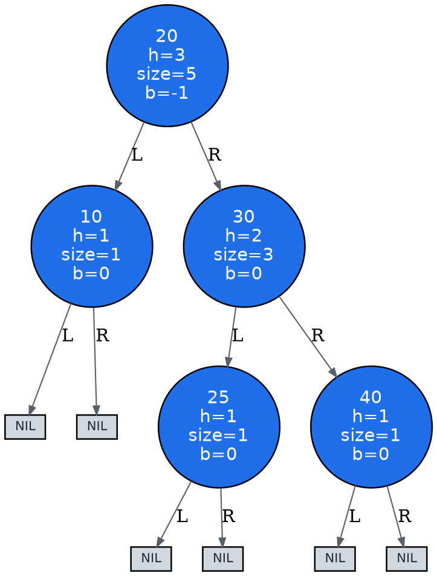

# AVL Tree Trace Walkthrough (build)

- input: `[30, 20, 10, 25, 40]`
- size: `5`
- height: `3`
- valid: `True`

## Tree snapshots

### Initial DOT

### Final DOT

## Event-by-event explanation

1. insert leaf 30
2. insert leaf 20
3. insert leaf 10
4. insert 10: right rotation at 30
5. insert leaf 25
6. insert leaf 40

## Final state

- root: `{'key': 20, 'height': 3, 'subtree_size': 5, 'balance': -1}`
- inorder traversal: `[10, 20, 25, 30, 40]`
- validation issues: `[]`
