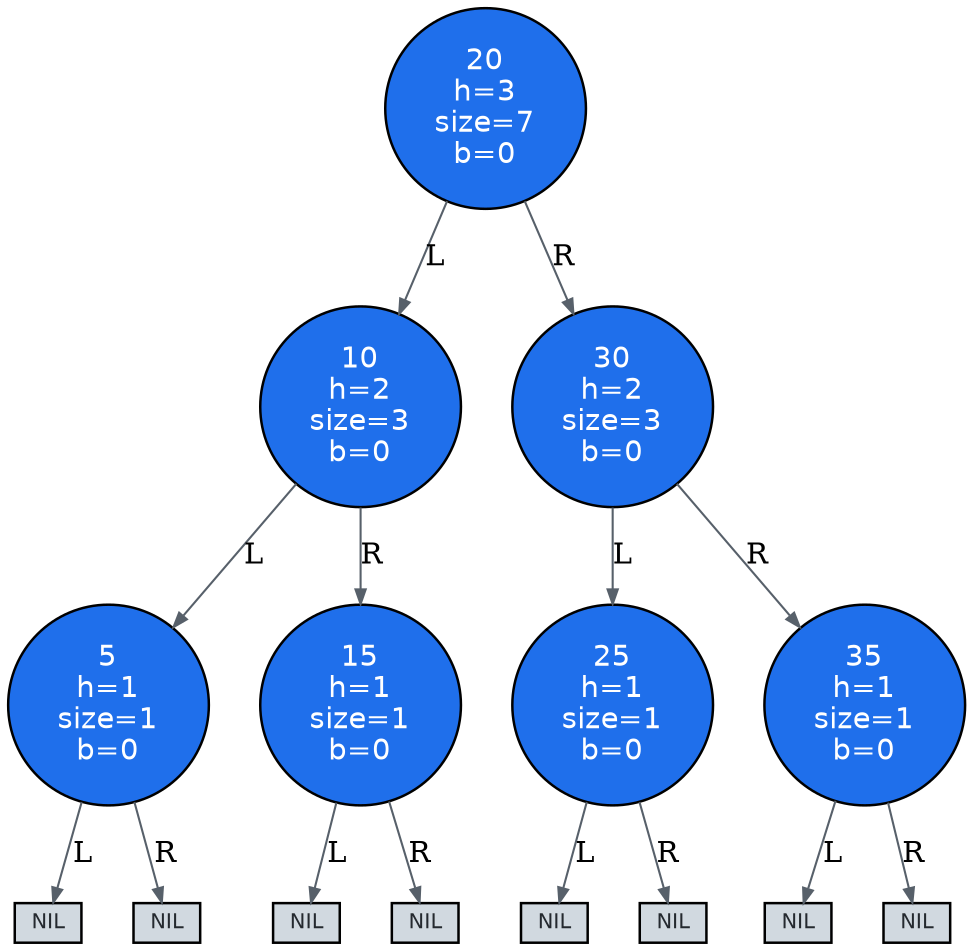
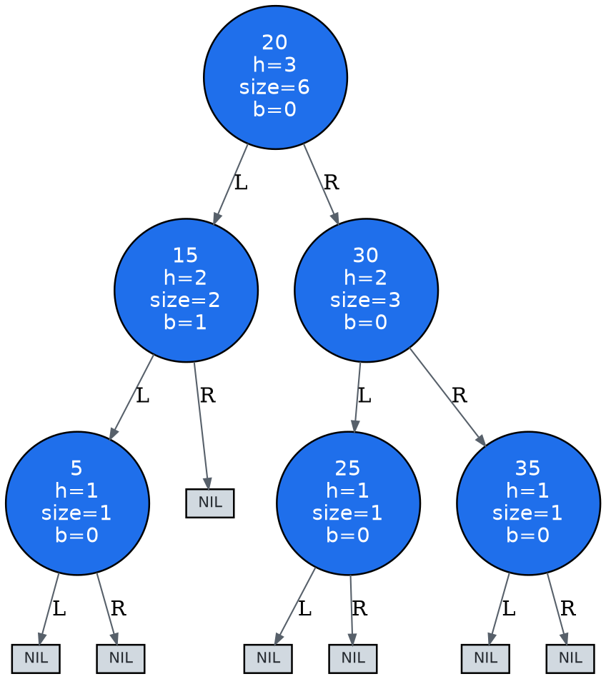

# AVL Tree Trace Walkthrough (delete)

- delete query: `10`
- deleted: `10`
- input: `[20, 10, 30, 5, 15, 25, 35]`
- size: `6`
- height: `3`
- valid: `True`

## Tree snapshots

### Initial DOT

### Final DOT

## Event-by-event explanation

1. delete key 10
2. replace 10 with successor 15
3. delete key 15

## Final state

- root: `{'key': 20, 'height': 3, 'subtree_size': 6, 'balance': 0}`
- inorder traversal: `[5, 15, 20, 25, 30, 35]`
- validation issues: `[]`
