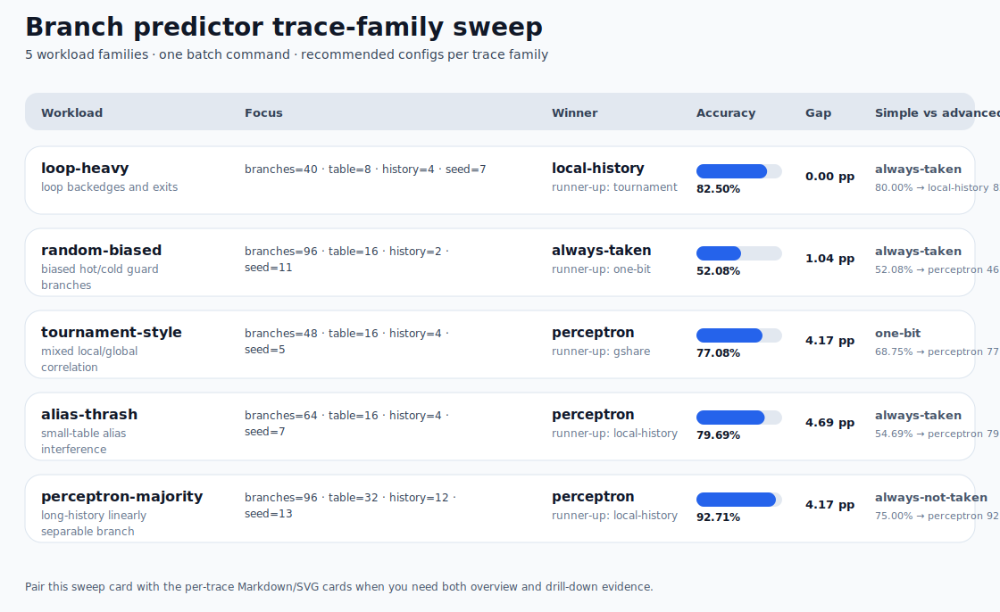
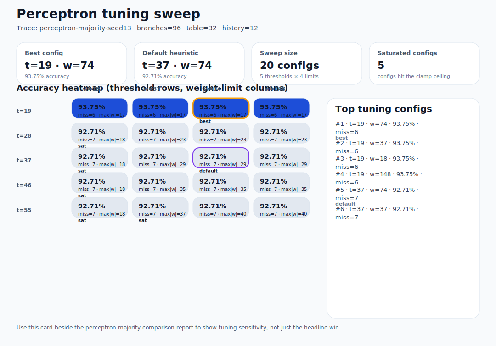
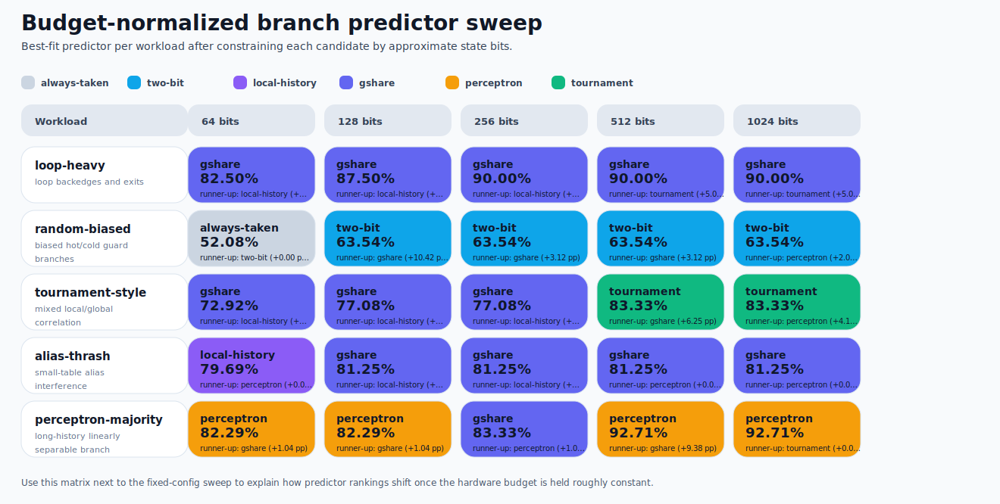
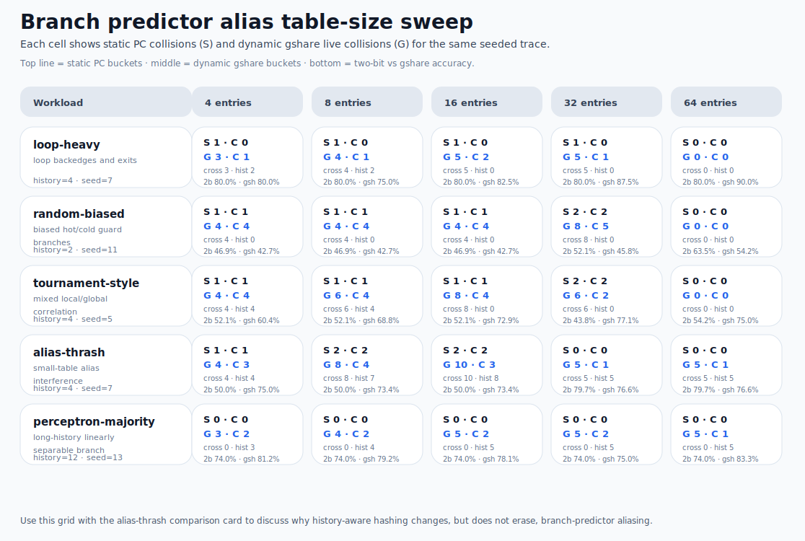
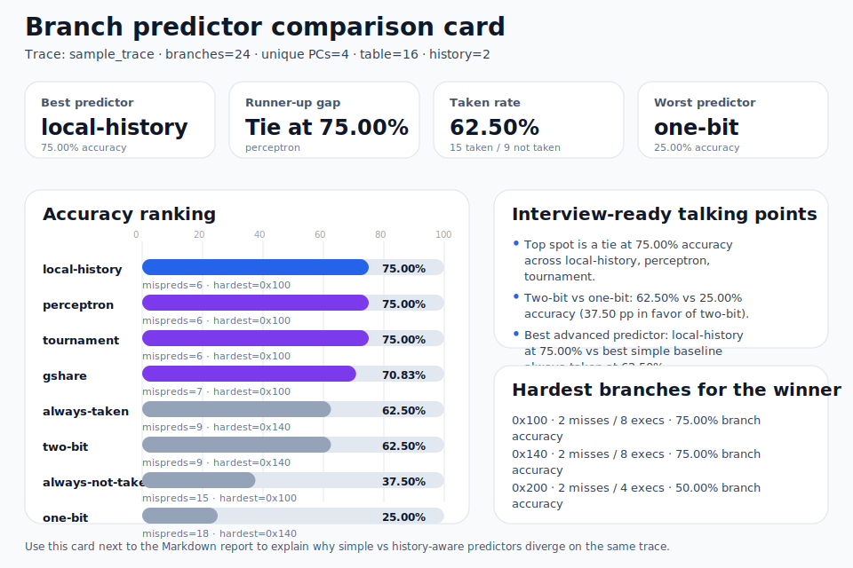
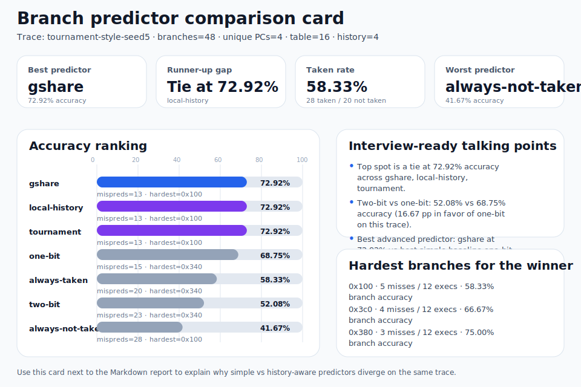
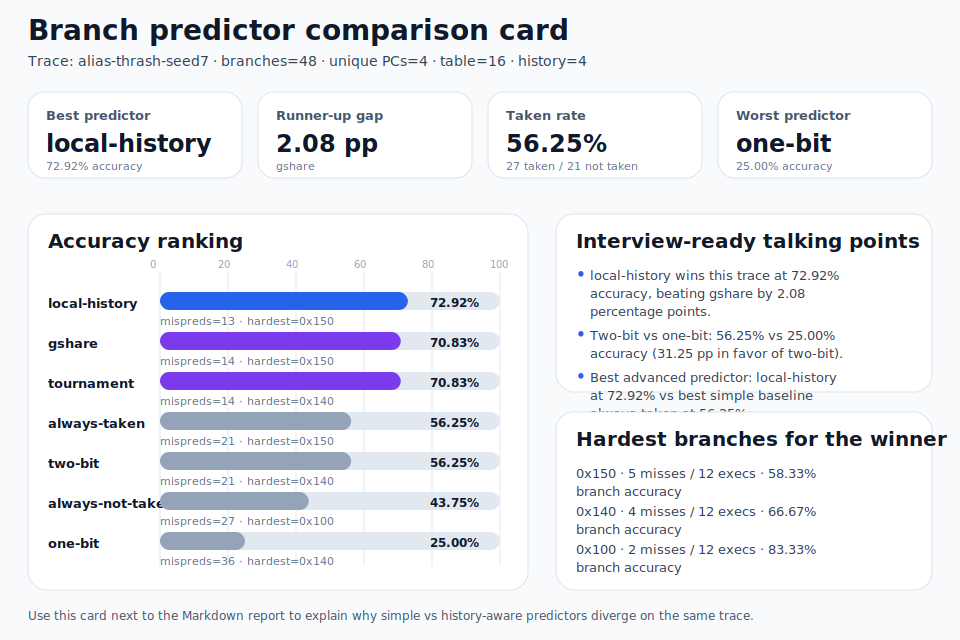
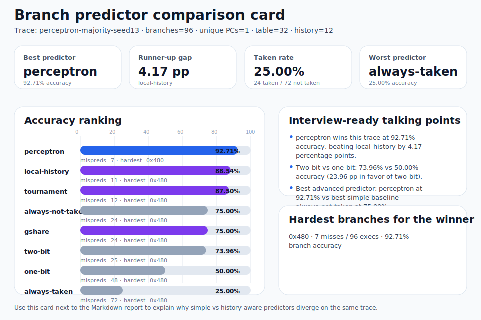

# Branch predictor artifact gallery

A compact gallery of committed comparison cards for `branch-predictor-lab`, meant for README linking, recruiter screenshots, and quick before/after predictor discussions.

## Sweep overview card

Use this when you want one artifact that summarizes how the best predictor changes across loop, bias, aliasing, hybrid-history, and perceptron-friendly traces.

  <strong>Trace-family sweep overview</strong> 
  
   
  <a href="./trace-family-sweep.md">Markdown report</a>

## Perceptron tuning sweep

Use this when you want a dedicated neural-predictor artifact that shows how threshold and signed-weight clamp choices affect the same long-history trace.

  <strong>Perceptron tuning heatmap</strong> 
  
   
  <a href="./perceptron-tuning-sweep.md">Markdown report</a>

## Budget-normalized sweep

Use this when you want to hold approximate predictor state budget constant and show that the winner can flip once hardware cost, not just raw accuracy, becomes the constraint.

  <strong>Budget-normalized winner matrix</strong> 
  
   
  <a href="./budget-sweep.md">Markdown report</a> ·
  <a href="./budget-sweep.csv">CSV export</a>

## Alias table-size sweep

Use this when you want to compare static PC aliasing against dynamic gshare collisions across the same workload family as the table grows.

  <strong>Alias table-size sweep grid</strong> 
  
   
  <a href="./table-size-sweep.md">Markdown report</a> ·
  <a href="./table-size-sweep.csv">CSV export</a>

## Comparison cards

<table>
  <tr>
    <td valign="top" width="50%">
      <strong>Bundled sample trace</strong> 
      
       
      <a href="./sample-trace-comparison.md">Markdown report</a>
    </td>
    <td valign="top" width="50%">
      <strong>`tournament-style` synthetic trace</strong> 
      
       
      <a href="./tournament-style-comparison.md">Markdown report</a>
    </td>
  </tr>
  <tr>
    <td valign="top" width="50%">
      <strong>`alias-thrash` synthetic trace</strong> 
      
       
      <a href="./alias-thrash-comparison.md">Markdown report</a>
    </td>
    <td valign="top" width="50%">
      <strong>`perceptron-majority` synthetic trace</strong> 
      
       
      <a href="./perceptron-majority-comparison.md">Markdown report</a>
    </td>
  </tr>
</table>

## Trace setup

- Sweep overview: `python3 projects/branch-predictor-lab/branch_predictor.py sweep --trace-dir artifacts/branch-predictor-lab/sweep --markdown-out docs/artifacts/branch-predictor-lab/trace-family-sweep.md --svg-out docs/artifacts/branch-predictor-lab/trace-family-sweep.svg`
- Budget-normalized sweep: `python3 projects/branch-predictor-lab/branch_predictor.py budget-sweep --trace-dir artifacts/branch-predictor-lab/budget-sweep --markdown-out docs/artifacts/branch-predictor-lab/budget-sweep.md --svg-out docs/artifacts/branch-predictor-lab/budget-sweep.svg --csv-out docs/artifacts/branch-predictor-lab/budget-sweep.csv`
- Alias table-size sweep: `python3 projects/branch-predictor-lab/branch_predictor.py table-size-sweep --trace-dir artifacts/branch-predictor-lab/table-size-sweep --markdown-out docs/artifacts/branch-predictor-lab/table-size-sweep.md --svg-out docs/artifacts/branch-predictor-lab/table-size-sweep.svg --csv-out docs/artifacts/branch-predictor-lab/table-size-sweep.csv`
- Bundled sample trace: `projects/branch-predictor-lab/sample_trace.txt` with `--table-size 16 --history-bits 2`
- Synthetic trace: `artifacts/branch-predictor-lab/tournament-style-seed5.trace` generated with `generate tournament-style --branches 48 --seed 5`, then compared with `--table-size 16 --history-bits 4`
- Alias trace: `artifacts/branch-predictor-lab/alias-thrash-seed7.trace` generated with `generate alias-thrash --branches 48 --seed 7`, then compared with `--table-size 16 --history-bits 4`
- Perceptron trace: `artifacts/branch-predictor-lab/perceptron-majority-seed13.trace` generated with `generate perceptron-majority --branches 96 --seed 13`, then compared with `--table-size 32 --history-bits 12`
- Perceptron tuning sweep: `python3 projects/branch-predictor-lab/branch_predictor.py perceptron-sweep artifacts/branch-predictor-lab/perceptron-majority-seed13.trace --table-size 32 --history-bits 12 --thresholds 19 28 37 46 55 --weight-limits 18 37 74 148 --markdown-out docs/artifacts/branch-predictor-lab/perceptron-tuning-sweep.md --svg-out docs/artifacts/branch-predictor-lab/perceptron-tuning-sweep.svg`

## Suggested portfolio usage

- Use the sweep overview card when you want one slide that proves different workload families reward different predictors and configs.
- Use the budget-normalized matrix when you want to explain that hardware budget can change the “best predictor” answer even on the same workload family. Keep the CSV nearby when you need to chart or filter the same winner matrix in a spreadsheet or slide deck.
- Use the alias table-size sweep when you want one artifact that shows static collisions can disappear while dynamic gshare conflicts still move around with history-dependent indexing.
- Use the sample trace card when you want a clean teaching story for loop exits, alternating phases, and cache-ish branches.
- Use the `tournament-style` card when you want to show that local/global/hybrid predictors can tie or trade places depending on the trace family and history depth.
- Use the `alias-thrash` card when you want to explain table interference, conflicting branch biases, dynamic gshare-history collisions, and why increasing table size can improve simple predictors without changing the trace.
- Use the `perceptron-majority` card when you want to show a neural predictor beating classic local/global tables on a long-history, linearly separable workload.
- Use the perceptron tuning heatmap when you want to show that neural predictors still need sensible threshold/clamp tuning instead of treating the perceptron as a magic black box.
- Pair the SVG card with its Markdown report when you need both a screenshot-friendly visual and a text artifact with exact rankings.
