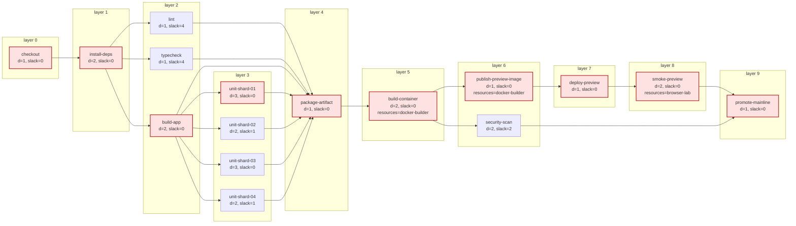

# Dependency graph — Generated Ci Pipeline

```mermaid
flowchart LR
  %% makespan=16
  %% critical_path=checkout,install-deps,build-app,unit-shard-01,package-artifact,build-container,publish-preview-image,deploy-preview,smoke-preview,promote-mainline
  classDef critical fill:#fee2e2,stroke:#b91c1c,stroke-width:2px
  subgraph layer_0["layer 0"]
    task_0["checkout<br/>d=1, slack=0"]
  end
  subgraph layer_1["layer 1"]
    task_1["install-deps<br/>d=2, slack=0"]
  end
  subgraph layer_2["layer 2"]
    task_2["build-app<br/>d=2, slack=0"]
    task_3["lint<br/>d=1, slack=4"]
    task_4["typecheck<br/>d=1, slack=4"]
  end
  subgraph layer_3["layer 3"]
    task_5["unit-shard-01<br/>d=3, slack=0"]
    task_6["unit-shard-02<br/>d=2, slack=1"]
    task_7["unit-shard-03<br/>d=3, slack=0"]
    task_8["unit-shard-04<br/>d=2, slack=1"]
  end
  subgraph layer_4["layer 4"]
    task_9["package-artifact<br/>d=1, slack=0"]
  end
  subgraph layer_5["layer 5"]
    task_10["build-container<br/>d=2, slack=0<br/>resources=docker-builder"]
  end
  subgraph layer_6["layer 6"]
    task_11["publish-preview-image<br/>d=1, slack=0<br/>resources=docker-builder"]
    task_13["security-scan<br/>d=2, slack=2"]
  end
  subgraph layer_7["layer 7"]
    task_12["deploy-preview<br/>d=1, slack=0"]
  end
  subgraph layer_8["layer 8"]
    task_14["smoke-preview<br/>d=2, slack=0<br/>resources=browser-lab"]
  end
  subgraph layer_9["layer 9"]
    task_15["promote-mainline<br/>d=1, slack=0"]
  end
  task_0 --> task_1
  task_1 --> task_2
  task_1 --> task_3
  task_1 --> task_4
  task_2 --> task_5
  task_2 --> task_6
  task_2 --> task_7
  task_2 --> task_8
  task_3 --> task_9
  task_4 --> task_9
  task_2 --> task_9
  task_5 --> task_9
  task_6 --> task_9
  task_7 --> task_9
  task_8 --> task_9
  task_9 --> task_10
  task_10 --> task_11
  task_11 --> task_12
  task_10 --> task_13
  task_12 --> task_14
  task_14 --> task_15
  task_13 --> task_15
  class task_0,task_1,task_2,task_5,task_9,task_10,task_11,task_12,task_14,task_15 critical
```
