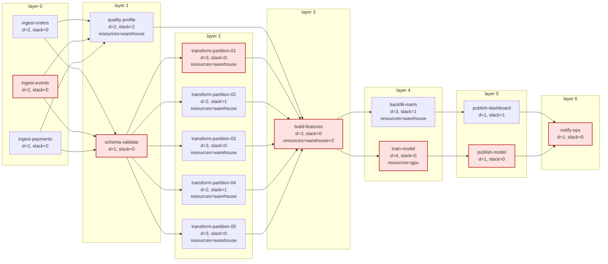

# Dependency graph — Generated Data Pipeline

```mermaid
flowchart LR
  %% makespan=15
  %% critical_path=ingest-events,schema-validate,transform-partition-01,build-features,train-model,publish-model,notify-ops
  classDef critical fill:#fee2e2,stroke:#b91c1c,stroke-width:2px
  subgraph layer_0["layer 0"]
    task_0["ingest-events<br/>d=2, slack=0"]
    task_1["ingest-orders<br/>d=2, slack=0"]
    task_2["ingest-payments<br/>d=2, slack=0"]
  end
  subgraph layer_1["layer 1"]
    task_3["quality-profile<br/>d=2, slack=2<br/>resources=warehouse"]
    task_4["schema-validate<br/>d=1, slack=0"]
  end
  subgraph layer_2["layer 2"]
    task_5["transform-partition-01<br/>d=3, slack=0<br/>resources=warehouse"]
    task_6["transform-partition-02<br/>d=2, slack=1<br/>resources=warehouse"]
    task_7["transform-partition-03<br/>d=3, slack=0<br/>resources=warehouse"]
    task_8["transform-partition-04<br/>d=2, slack=1<br/>resources=warehouse"]
    task_9["transform-partition-05<br/>d=3, slack=0<br/>resources=warehouse"]
  end
  subgraph layer_3["layer 3"]
    task_10["build-features<br/>d=3, slack=0<br/>resources=warehouse×2"]
  end
  subgraph layer_4["layer 4"]
    task_11["backfill-marts<br/>d=3, slack=1<br/>resources=warehouse"]
    task_13["train-model<br/>d=4, slack=0<br/>resources=gpu"]
  end
  subgraph layer_5["layer 5"]
    task_12["publish-dashboard<br/>d=1, slack=1"]
    task_14["publish-model<br/>d=1, slack=0"]
  end
  subgraph layer_6["layer 6"]
    task_15["notify-ops<br/>d=1, slack=0"]
  end
  task_1 --> task_3
  task_0 --> task_3
  task_2 --> task_3
  task_1 --> task_4
  task_0 --> task_4
  task_2 --> task_4
  task_4 --> task_5
  task_4 --> task_6
  task_4 --> task_7
  task_4 --> task_8
  task_4 --> task_9
  task_3 --> task_10
  task_5 --> task_10
  task_6 --> task_10
  task_7 --> task_10
  task_8 --> task_10
  task_9 --> task_10
  task_10 --> task_11
  task_11 --> task_12
  task_10 --> task_13
  task_13 --> task_14
  task_12 --> task_15
  task_14 --> task_15
  class task_0,task_4,task_5,task_10,task_13,task_14,task_15 critical
```
