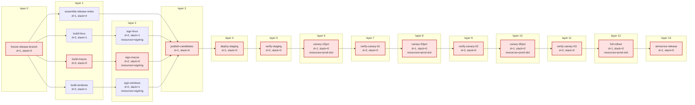

# Dependency graph — Generated Release Pipeline

```mermaid
flowchart LR
  %% makespan=21
  %% critical_path=freeze-release-branch,build-macos,sign-macos,publish-candidates,deploy-staging,verify-staging,canary-10pct,verify-canary-01,canary-50pct,verify-canary-02,canary-90pct,verify-canary-03,full-rollout,announce-release
  classDef critical fill:#fee2e2,stroke:#b91c1c,stroke-width:2px
  subgraph layer_0["layer 0"]
    task_0["freeze-release-branch<br/>d=1, slack=0"]
  end
  subgraph layer_1["layer 1"]
    task_1["assemble-release-notes<br/>d=1, slack=4"]
    task_2["build-linux<br/>d=2, slack=1"]
    task_3["build-macos<br/>d=3, slack=0"]
    task_4["build-windows<br/>d=2, slack=1"]
  end
  subgraph layer_2["layer 2"]
    task_5["sign-linux<br/>d=2, slack=1<br/>resources=signing"]
    task_6["sign-macos<br/>d=2, slack=0<br/>resources=signing"]
    task_7["sign-windows<br/>d=2, slack=1<br/>resources=signing"]
  end
  subgraph layer_3["layer 3"]
    task_8["publish-candidates<br/>d=1, slack=0"]
  end
  subgraph layer_4["layer 4"]
    task_9["deploy-staging<br/>d=1, slack=0"]
  end
  subgraph layer_5["layer 5"]
    task_10["verify-staging<br/>d=2, slack=0"]
  end
  subgraph layer_6["layer 6"]
    task_11["canary-10pct<br/>d=1, slack=0<br/>resources=prod-slot"]
  end
  subgraph layer_7["layer 7"]
    task_12["verify-canary-01<br/>d=2, slack=0"]
  end
  subgraph layer_8["layer 8"]
    task_13["canary-50pct<br/>d=1, slack=0<br/>resources=prod-slot"]
  end
  subgraph layer_9["layer 9"]
    task_14["verify-canary-02<br/>d=2, slack=0"]
  end
  subgraph layer_10["layer 10"]
    task_15["canary-90pct<br/>d=1, slack=0<br/>resources=prod-slot"]
  end
  subgraph layer_11["layer 11"]
    task_16["verify-canary-03<br/>d=2, slack=0"]
  end
  subgraph layer_12["layer 12"]
    task_17["full-rollout<br/>d=1, slack=0<br/>resources=prod-slot"]
  end
  subgraph layer_13["layer 13"]
    task_18["announce-release<br/>d=1, slack=0"]
  end
  task_0 --> task_1
  task_0 --> task_2
  task_0 --> task_3
  task_0 --> task_4
  task_2 --> task_5
  task_3 --> task_6
  task_4 --> task_7
  task_1 --> task_8
  task_5 --> task_8
  task_6 --> task_8
  task_7 --> task_8
  task_8 --> task_9
  task_9 --> task_10
  task_10 --> task_11
  task_11 --> task_12
  task_12 --> task_13
  task_13 --> task_14
  task_14 --> task_15
  task_15 --> task_16
  task_16 --> task_17
  task_17 --> task_18
  class task_0,task_3,task_6,task_8,task_9,task_10,task_11,task_12,task_13,task_14,task_15,task_16,task_17,task_18 critical
```
