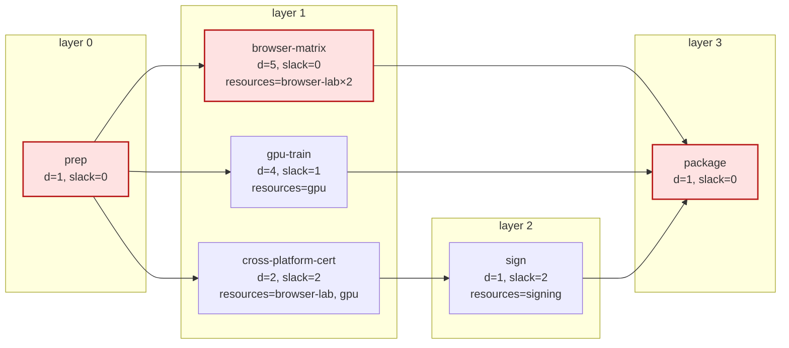

# Dependency graph — Multi Resource Graph

```mermaid
flowchart LR
  %% makespan=7
  %% critical_path=prep,browser-matrix,package
  classDef critical fill:#fee2e2,stroke:#b91c1c,stroke-width:2px
  subgraph layer_0["layer 0"]
    task_0["prep<br/>d=1, slack=0"]
  end
  subgraph layer_1["layer 1"]
    task_1["browser-matrix<br/>d=5, slack=0<br/>resources=browser-lab×2"]
    task_2["cross-platform-cert<br/>d=2, slack=2<br/>resources=browser-lab, gpu"]
    task_3["gpu-train<br/>d=4, slack=1<br/>resources=gpu"]
  end
  subgraph layer_2["layer 2"]
    task_4["sign<br/>d=1, slack=2<br/>resources=signing"]
  end
  subgraph layer_3["layer 3"]
    task_5["package<br/>d=1, slack=0"]
  end
  task_0 --> task_1
  task_0 --> task_2
  task_0 --> task_3
  task_2 --> task_4
  task_1 --> task_5
  task_3 --> task_5
  task_4 --> task_5
  class task_0,task_1,task_5 critical
```
