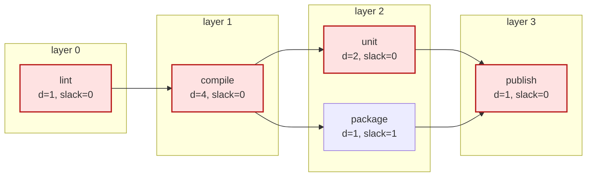

# Sample dependency graph

```mermaid
flowchart LR
  %% makespan=8
  %% critical_path=lint,compile,unit,publish
  classDef critical fill:#fee2e2,stroke:#b91c1c,stroke-width:2px
  subgraph layer_0["layer 0"]
    task_0["lint<br/>d=1, slack=0"]
  end
  subgraph layer_1["layer 1"]
    task_1["compile<br/>d=4, slack=0"]
  end
  subgraph layer_2["layer 2"]
    task_2["package<br/>d=1, slack=1"]
    task_3["unit<br/>d=2, slack=0"]
  end
  subgraph layer_3["layer 3"]
    task_4["publish<br/>d=1, slack=0"]
  end
  task_0 --> task_1
  task_1 --> task_2
  task_1 --> task_3
  task_3 --> task_4
  task_2 --> task_4
  class task_0,task_1,task_3,task_4 critical
```
