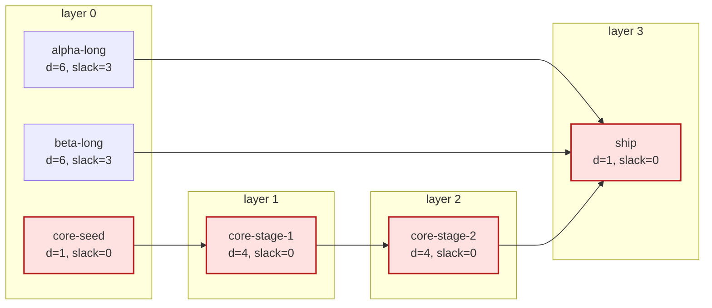

# Dependency graph — Strategy Graph

```mermaid
flowchart LR
  %% makespan=10
  %% critical_path=core-seed,core-stage-1,core-stage-2,ship
  classDef critical fill:#fee2e2,stroke:#b91c1c,stroke-width:2px
  subgraph layer_0["layer 0"]
    task_0["alpha-long<br/>d=6, slack=3"]
    task_1["beta-long<br/>d=6, slack=3"]
    task_2["core-seed<br/>d=1, slack=0"]
  end
  subgraph layer_1["layer 1"]
    task_3["core-stage-1<br/>d=4, slack=0"]
  end
  subgraph layer_2["layer 2"]
    task_4["core-stage-2<br/>d=4, slack=0"]
  end
  subgraph layer_3["layer 3"]
    task_5["ship<br/>d=1, slack=0"]
  end
  task_2 --> task_3
  task_3 --> task_4
  task_0 --> task_5
  task_1 --> task_5
  task_4 --> task_5
  class task_2,task_3,task_4,task_5 critical
```
