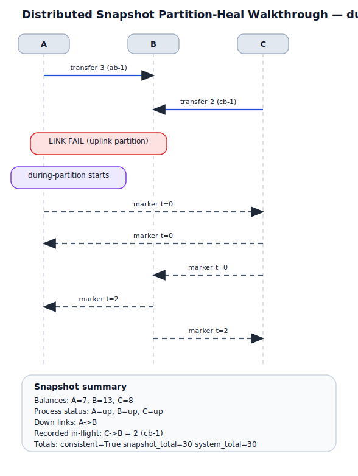
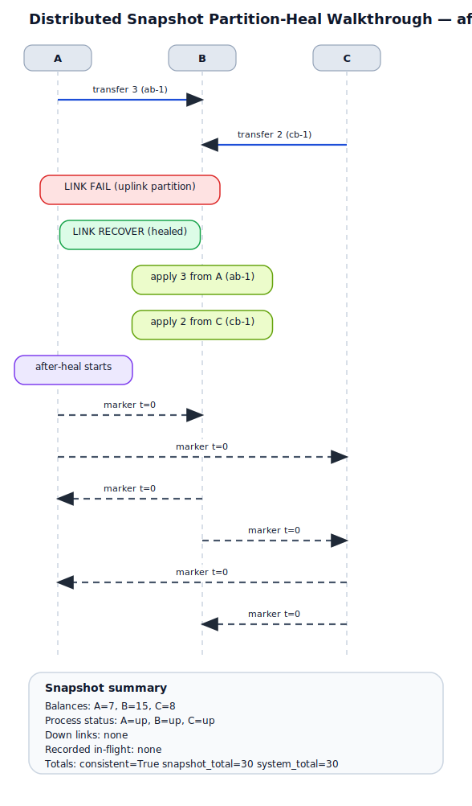

# Distributed Snapshot Partition-Heal Walkthrough

## Scenario summary
- processes: A, B, C
- snapshots captured: 2
- final balances: A=7, B=15, C=8
- final process statuses: A=up, B=up, C=up
- final down links: none
- system total: 30

## Timeline
1. sent `ab-1` carrying 3 from `A` to `B`; balances now A=7, B=10, C=10
2. sent `cb-1` carrying 2 from `C` to `B`; balances now A=7, B=10, C=8
3. link `A->B` failed (uplink partition); channel statuses now A->B=down, A->C=up, B->A=up, B->C=up, C->A=up, C->B=up
4. captured snapshot `during-partition` from `A`; consistent=True
5. link `A->B` recovered (healed); channel statuses now A->B=up, A->C=up, B->A=up, B->C=up, C->A=up, C->B=up
6. delivered `ab-1` from `A` to `B`; balances now A=7, B=13, C=8
7. delivered `cb-1` from `C` to `B`; balances now A=7, B=15, C=8
8. captured snapshot `after-heal` from `A`; consistent=True

## Snapshot walkthrough

### Snapshot `during-partition` (script step 4)
- initiator: `A`
- balances: A=7, B=13, C=8
- process statuses: A=up, B=up, C=up
- down links: A->B
- consistent totals: `True` (30 vs 30)
- SVG asset: [distributed-snapshot-partition-heal-01-during-partition.svg](distributed-snapshot-partition-heal-svg/distributed-snapshot-partition-heal-01-during-partition.svg)
- PNG asset: [distributed-snapshot-partition-heal-01-during-partition.png](distributed-snapshot-partition-heal-png/distributed-snapshot-partition-heal-01-during-partition.png)
- recorded in-flight messages:
  - `C->B`: 2 (cb-1)



```mermaid
sequenceDiagram
    participant A
    participant B
    participant C
    A->>B: transfer 3 (ab-1)
    C->>B: transfer 2 (cb-1)
    Note over A,B: LINK FAIL (uplink partition)
    Note over A: during-partition starts
    A-->>C: marker t=0
    C-->>A: marker t=0
    C-->>B: marker t=0
    B-->>A: marker t=2
    B-->>C: marker t=2
    Note over A,B,C: snapshot balances A=7, B=13, C=8
    Note over A,B,C: process status A=up, B=up, C=up
    Note over A,B,C: down links A->B
    Note over C,B: recorded in-flight on C->B 2 (cb-1)
    Note over A,B,C: consistent=True snapshot_total=30 system_total=30
```

### Snapshot `after-heal` (script step 8)
- initiator: `A`
- balances: A=7, B=15, C=8
- process statuses: A=up, B=up, C=up
- down links: none
- consistent totals: `True` (30 vs 30)
- SVG asset: [distributed-snapshot-partition-heal-02-after-heal.svg](distributed-snapshot-partition-heal-svg/distributed-snapshot-partition-heal-02-after-heal.svg)
- PNG asset: [distributed-snapshot-partition-heal-02-after-heal.png](distributed-snapshot-partition-heal-png/distributed-snapshot-partition-heal-02-after-heal.png)
- recorded in-flight messages: none



```mermaid
sequenceDiagram
    participant A
    participant B
    participant C
    A->>B: transfer 3 (ab-1)
    C->>B: transfer 2 (cb-1)
    Note over A,B: LINK FAIL (uplink partition)
    Note over A,B: LINK RECOVER (healed)
    Note over B: apply 3 from A (ab-1)
    Note over B: apply 2 from C (cb-1)
    Note over A: after-heal starts
    A-->>B: marker t=0
    A-->>C: marker t=0
    B-->>A: marker t=0
    B-->>C: marker t=0
    C-->>A: marker t=0
    C-->>B: marker t=0
    Note over A,B,C: snapshot balances A=7, B=15, C=8
    Note over A,B,C: process status A=up, B=up, C=up
    Note over A,B,C: no recorded in-flight channel messages
    Note over A,B,C: consistent=True snapshot_total=30 system_total=30
```
