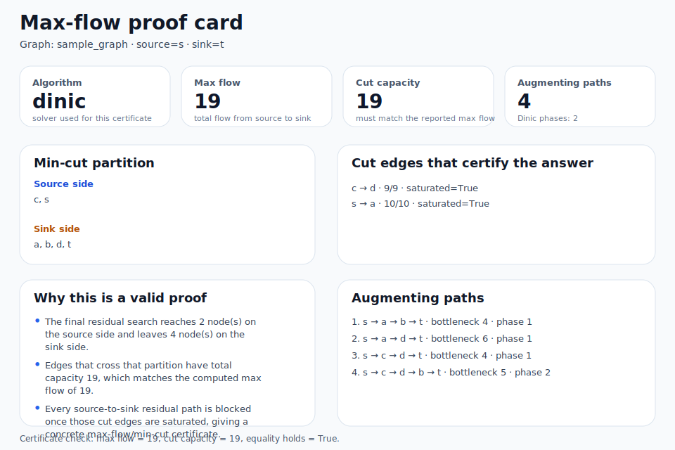
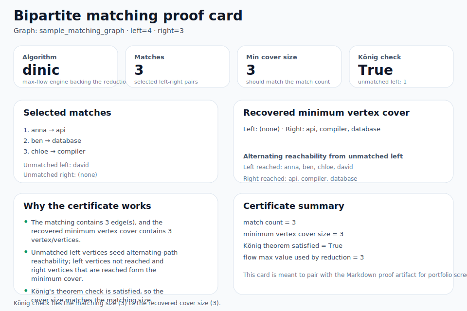
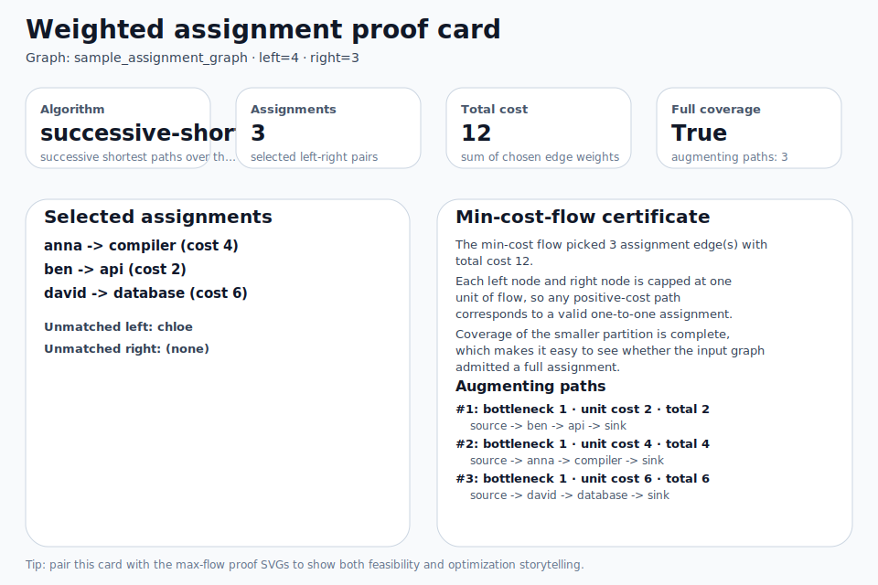
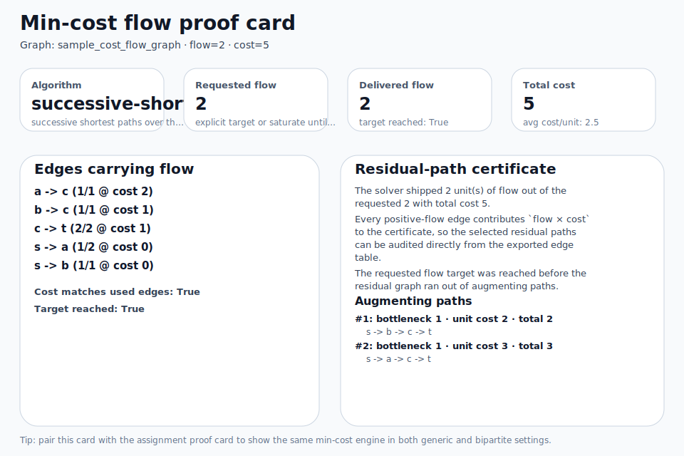
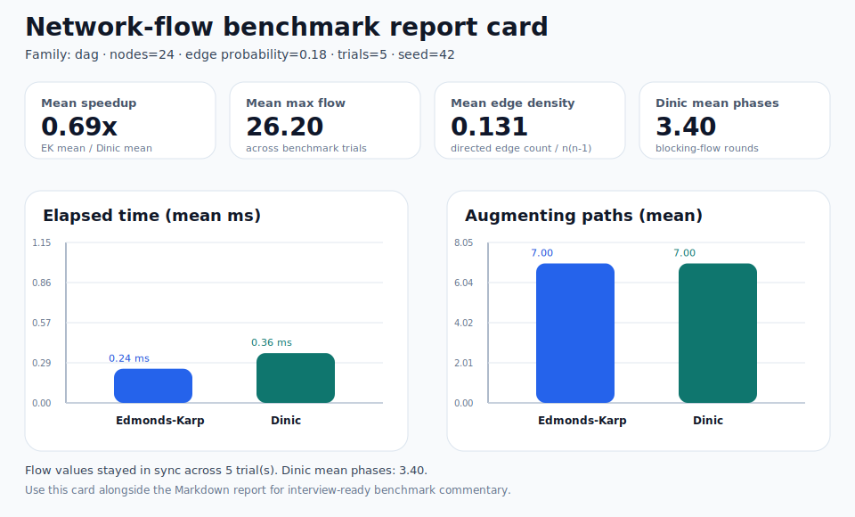
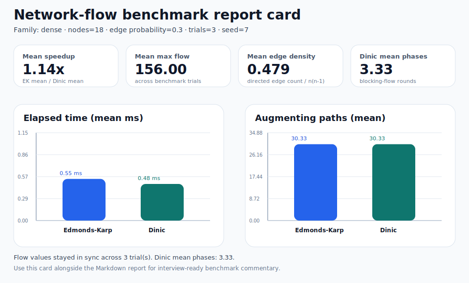
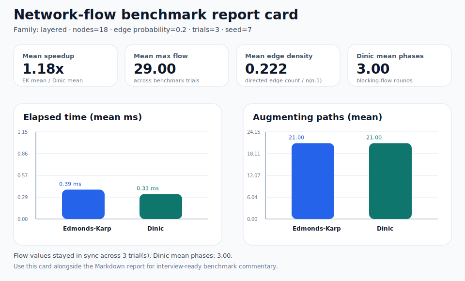

# Network-flow lab artifact gallery

A compact index of the committed artifacts for `network-flow-lab`, aimed at quick README linking, recruiter-friendly browsing, and fast screenshot selection.

## Browser landing page

- [Open the combined HTML artifact gallery](./artifact-gallery.html)
- Use it when you want the weighted-assignment and generic min-cost-flow walkthroughs in one browser tab before drilling into the individual proof/DOT files.

## Proof cards

| Flow proof card | Matching proof card |
| --- | --- |
|  |  |
| [Markdown proof](./sample-flow-proof.md) | [Markdown proof](./sample-matching-proof.md) |

| Weighted assignment proof card | Generic min-cost-flow proof card |
| --- | --- |
|  |  |
| [Markdown proof](./sample-assignment-proof.md) · [DOT diagram source](./sample-assignment.dot) · [Side-by-side artifact page](./sample-assignment-artifact-page.html) | [Markdown proof](./sample-cost-flow-proof.md) · [DOT diagram source](./sample-cost-flow.dot) · [Side-by-side artifact page](./sample-cost-flow-artifact-page.html) |

## Benchmark report cards

<table>
  <tr>
    <td valign="top" width="33%">
      <strong>DAG baseline</strong> 
      
       
      <a href="./benchmark-dag-report.md">Markdown report</a>
    </td>
    <td valign="top" width="33%">
      <strong>Dense residual mesh</strong> 
      
       
      <a href="./benchmark-dense-report.md">Markdown report</a>
    </td>
    <td valign="top" width="33%">
      <strong>Layered cut stress</strong> 
      
       
      <a href="./benchmark-layered-report.md">Markdown report</a>
    </td>
  </tr>
</table>

## Suggested portfolio usage

- Lead with the SVG cards when you need a visual summary without terminal screenshots.
- Pair one proof card with one benchmark report to show both correctness and performance storytelling.
- Use the weighted assignment card when you want a recruiter-friendly optimization example instead of only a feasibility/cut proof.
- Use the generic min-cost-flow card when you want to show the same optimization engine on a non-bipartite shipping/routing-style graph.
- Link the new side-by-side HTML pages when you want GitHub Pages viewers to browse the diagrams and proof cards without opening separate files.
- Link this gallery from project-level README files so reviewers can jump straight into the artifacts.
