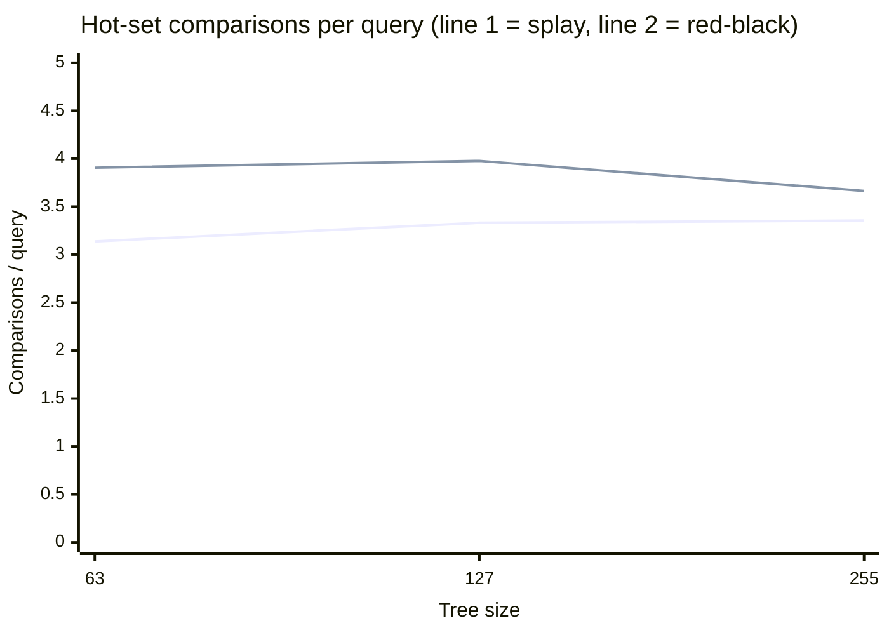
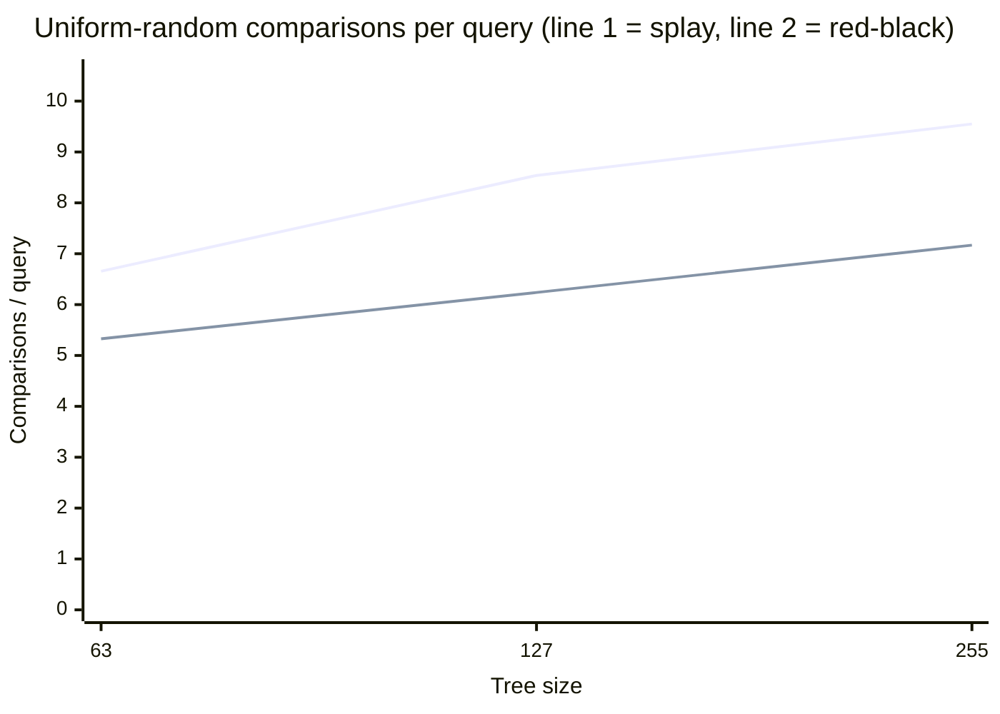

# Splay Tree Benchmark Report

## Setup

- sizes: `[63, 127, 255]`
- hot-set size: `8`
- hot queries per size: `256`
- uniform-random queries per size: `256`
- seed base: `42`
- interpretation rule: positive gap means the splay tree used fewer total key comparisons than the red-black baseline

## Embedded artifact links

- full benchmark-series JSON: [`splay-tree-benchmark-series.json`](../../artifacts/splay-tree-benchmark-series.json)
- chart-ready CSV rows: [`splay-tree-benchmark-series.csv`](../../artifacts/splay-tree-benchmark-series.csv)

## Summary

- Best hot-set result: size `63` with a `+197` comparison gap and splay averaging `3.137` comparisons/query.
- Most favorable uniform-random result: size `63` with a `-340` comparison gap and splay averaging `6.656` comparisons/query.
- Hot-set workloads should usually favor splay trees more strongly than uniform-random workloads, which gives you a clean locality story for interviews.

## Per-size metrics

| Size | Seed | Hot-set gap (RB-Splay comps) | Uniform gap (RB-Splay comps) | Hot-set splay cmp/query | Hot-set RB cmp/query | Uniform splay cmp/query | Uniform RB cmp/query |
| --- | ---: | ---: | ---: | ---: | ---: | ---: | ---: |
| 63 | 42 | +197 | -340 | 3.137 | 3.906 | 6.656 | 5.328 |
| 127 | 43 | +165 | -589 | 3.332 | 3.977 | 8.539 | 6.238 |
| 255 | 44 | +79 | -610 | 3.355 | 3.664 | 9.551 | 7.168 |

## Hot-set chart

## Uniform-random chart

## Interview talking points

- The hot-set chart makes the self-adjusting value proposition visible: repeated popular keys move toward the root and stay cheap to revisit.
- The uniform-random chart keeps the story honest by showing where locality fades and the red-black baseline can stay competitive.
- Because the report links directly to committed JSON/CSV artifacts, you can reuse the same data in portfolio charts without rerunning ad-hoc analysis.
