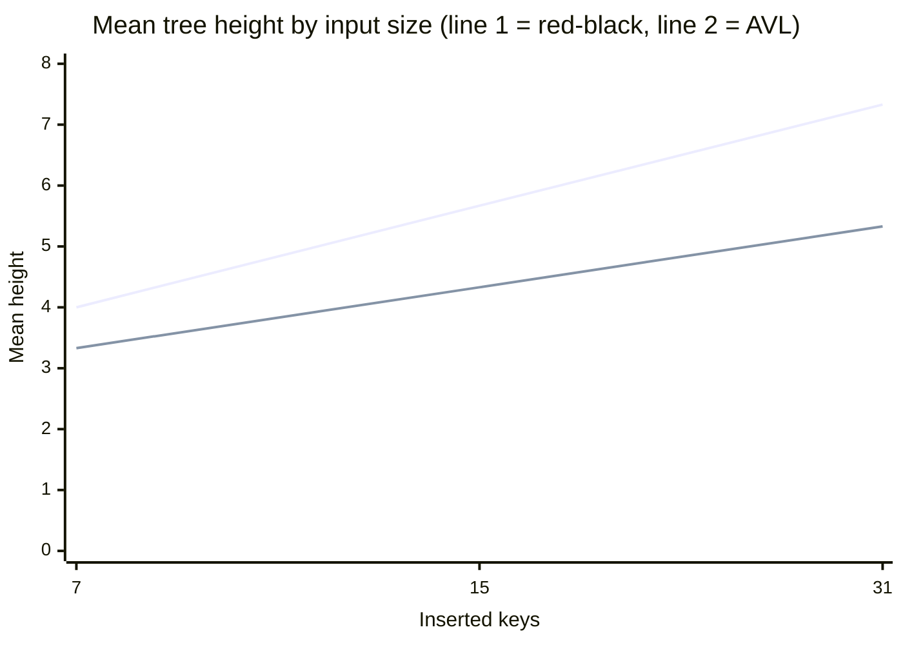
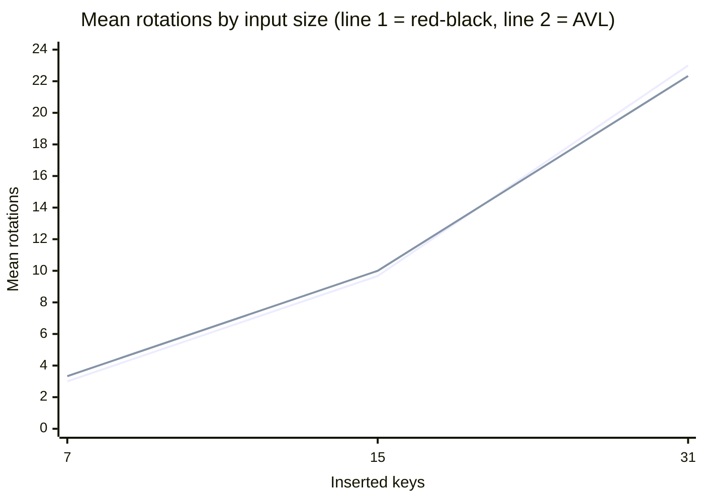

# Red-Black vs AVL Benchmark Report

## Setup

- counts: `[7, 15, 31]`
- start: `1`
- seed: `11`
- cases per count: `ascending`, `descending`, `shuffled`

## Summary

- Across 3 benchmark sizes, red-black trees averaged `5.67` height versus `4.33` for AVL.
- The largest absolute height gap showed up at count `31` with an AVL-minus-RB gap of `-2.00` (negative means AVL was shorter).
- The largest absolute rotation gap showed up at count `31` with an AVL-minus-RB rotation gap of `-0.67` (positive means AVL rotated more).

## Per-size metrics

| Count | RB mean height | AVL mean height | AVL-RB height gap | RB mean rotations | AVL mean rotations | AVL-RB rotation gap |
| --- | ---: | ---: | ---: | ---: | ---: | ---: |
| 7 | 4.00 | 3.33 | -0.67 | 3.00 | 3.33 | 0.33 |
| 15 | 5.67 | 4.33 | -1.33 | 9.67 | 10.00 | 0.33 |
| 31 | 7.33 | 5.33 | -2.00 | 23.00 | 22.33 | -0.67 |

## Height chart

## Rotation chart

## Interview talking points

- AVL stays shorter on these runs, while rotation counts stay close enough to discuss the trade-off instead of claiming one tree always dominates.
- Ascending and descending inserts are still deterministic worst-style inputs, so the report makes a useful recruiter-facing stress test instead of a lucky random demo.
- The charts and table can be checked into the repo or pasted into a portfolio page without re-running ad-hoc spreadsheet tooling.
