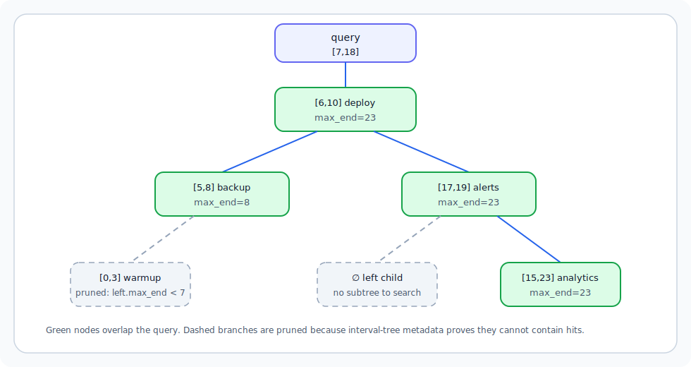

# interval-tree-lab

A portfolio-friendly interval tree lab that supports overlap queries and point stabbing queries with `max_end` augmentation.

## Why it is interesting
- demonstrates a classic augmented search-tree technique instead of a plain BST or array scan
- shows how interval overlap search can prune whole subtrees using metadata
- connects directly to schedulers, booking systems, compilers, geometric search, and genomic range tooling
- makes an interview-heavy data structure concrete, inspectable, and testable

## Features
- immutable interval model with optional labels
- balanced bulk build from sorted unique intervals for stable demos
- incremental insert and deletion with `max_end` metadata refresh
- find any overlap, find all overlaps, and point stabbing queries
- reproducible synthetic benchmark that compares pruned interval-tree searches versus naive scans
- benchmark-series command that scales workloads across multiple interval counts and can write JSON/CSV artifacts for portfolio evidence
- per-query node-visit stats for making pruning behavior visible in JSON output
- bundled `sample_intervals.json` artifact for quick inspection and demo data
- validation for BST ordering and `max_end` correctness
- JSON CLI output for demo, build, overlap, point, insert, delete, trace, benchmark, and benchmark-series flows
- Graphviz DOT query-trace export that highlights visited, pruned, and overlapping branches
- `explain` mode that narrates why each subtree was searched or pruned for one overlap query
- optional trace artifact rendering to DOT, SVG, or PNG files for portfolio screenshots and README embeds

## Usage

Run the bundled demo:

```bash
python3 projects/interval-tree-lab/interval_tree_lab.py demo
```

Build a tree from interval specs:

```bash
python3 projects/interval-tree-lab/interval_tree_lab.py build 0-3:warmup 5-8:backup 6-10:deploy 15-23:analytics
```

Find which intervals overlap a query:

```bash
python3 projects/interval-tree-lab/interval_tree_lab.py overlap 7-18 0-3:warmup 5-8:backup 6-10:deploy 15-23:analytics 17-19:alerts
```

Find which intervals contain a point:

```bash
python3 projects/interval-tree-lab/interval_tree_lab.py point 26 15-23:analytics 19-20:maintenance 25-30:etl 26-26:ping
```

Insert a new interval:

```bash
python3 projects/interval-tree-lab/interval_tree_lab.py insert 8-12:patch 0-3:warmup 5-8:backup 15-23:analytics
```

Delete an interval and repair the augmented metadata:

```bash
python3 projects/interval-tree-lab/interval_tree_lab.py delete 8-12:patch 0-3:warmup 5-8:backup 8-12:patch 15-23:analytics
```

Benchmark interval-tree pruning against a naive scan:

```bash
python3 projects/interval-tree-lab/interval_tree_lab.py benchmark --intervals 800 --queries 400 --seed 11
```

Generate a portfolio-ready benchmark series with JSON and CSV artifacts:

```bash
python3 projects/interval-tree-lab/interval_tree_lab.py benchmark-series --interval-counts 100,250,500,1000 --queries 250 --output-json artifacts/interval-tree-benchmark-series.json --output-csv artifacts/interval-tree-benchmark-series.csv
```

Export a Graphviz DOT trace for one query (render later with Graphviz if desired):

```bash
python3 projects/interval-tree-lab/interval_tree_lab.py trace 7-18 0-3:warmup 5-8:backup 6-10:deploy 15-23:analytics 17-19:alerts
```

Write a trace artifact directly to disk for portfolio screenshots or docs (SVG/PNG requires `dot` from Graphviz on `PATH`):

```bash
python3 projects/interval-tree-lab/interval_tree_lab.py trace 7-18 0-3:warmup 5-8:backup 6-10:deploy 15-23:analytics 17-19:alerts --output docs/artifacts/interval-tree-trace.dot --format dot
```

Explain the pruning decisions step by step for one overlap query:

```bash
python3 projects/interval-tree-lab/interval_tree_lab.py explain 7-18 0-3:warmup 5-8:backup 6-10:deploy 15-23:analytics 17-19:alerts
```

## Example artifact



The checked-in SVG gives you a portfolio-ready screenshot even on machines that do not have Graphviz installed. You can still regenerate DOT/SVG/PNG artifacts locally with the `trace --output` command when `dot` is available.

## Test

```bash
./.venv/bin/python -m pytest -q tests/test_interval_tree_lab.py
python3 -m unittest projects/interval-tree-lab/test_interval_tree_lab.py
python3 scripts/audit_interval_tree_readme_commands.py
```

## Complexity intuition
- **Build from sorted unique intervals:** `O(n)` time for the balanced bulk-build helper and `O(n)` space for the nodes.
- **Insert/delete:** `O(h)` time where `h` is tree height, because only one search path plus metadata refreshes are touched. In the balanced demo flow that is usually close to `O(log n)`; in a badly skewed incremental tree it can degrade toward `O(n)`.
- **Overlap / point queries:** best case is near `O(1)` when the root immediately proves most branches irrelevant, average behavior is typically closer to `O(log n + k)` for balanced trees with `k` reported matches, and worst case is `O(n)` when many intervals overlap or the tree becomes skewed enough that pruning loses power.
- **Why `max_end` matters:** without augmentation, a naive scan inspects every interval. With `max_end`, the search can discard entire left subtrees as soon as their maximum end falls before the query start.

## Design notes
- Intervals are closed ranges `[start, end]`, so touching endpoints count as overlap.
- Nodes are ordered lexicographically by `(start, end, label)` to keep traversals deterministic.
- Each node stores the maximum `end` value in its subtree. During overlap search, if the left subtree's `max_end` is below the query start, that entire subtree can be skipped.
- Bulk builds use median splitting on the sorted interval list to avoid obviously skewed demo trees.
- Validation checks both BST ordering and `max_end` propagation so augmentation bugs are easy to catch.
- The benchmark uses a deterministic random seed, verifies interval-tree and naive-scan overlap results match, and reports average node visits to make pruning effectiveness inspectable instead of hand-wavy.
- The `benchmark-series` command intentionally increments the seed per row so each interval count gets a reproducible but non-identical workload snapshot.
- The `trace` command still emits DOT inline in JSON output, but can now also write DOT/SVG/PNG artifacts to disk when you want concrete portfolio assets.
- The `explain` command turns one query into a step-by-step narrative that says why each subtree was searched or pruned, which is useful for interviews and README screenshots.
- SVG/PNG rendering is optional and only requires Graphviz `dot` when you explicitly ask for a rendered artifact.

## Future improvements
- add canned example artifact files under `docs/artifacts/` for a couple of canonical trace scenarios
- add range-update or interval-assignment variants for scheduling-heavy demonstrations
- add CSV/plot export for benchmark runs across multiple workload sizes
