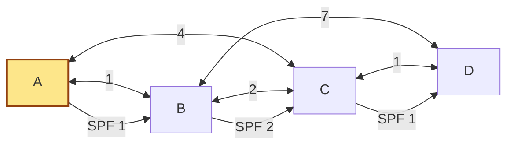

# link-state-routing-lab

A Python routing lab that simulates a small link-state protocol: routers originate link-state advertisements (LSAs), flood them through the network, maintain a shared link-state database (LSDB), and run Dijkstra shortest-path recomputation to build forwarding tables.

## Why it is portfolio-worthy
- shows networking knowledge beyond distance-vector routing
- demonstrates graph algorithms with a practical systems framing
- includes protocol details such as flooding, sequence numbers, and LSA aging/withdrawal
- keeps the simulation local, testable, and easy to extend with topology events
- now exports Mermaid diagrams that make the lab easier to demo in GitHub docs and READMEs

## Features
- validates symmetric weighted network topologies
- originates per-router LSAs with monotonically increasing sequence numbers
- floods LSAs hop-by-hop and records propagation events
- discards stale LSAs and withdraws expired entries at max age
- computes per-router forwarding tables with deterministic tie-breaking
- renders Mermaid topology diagrams with optional source-rooted SPF tree overlays
- provides a CLI for human-readable, JSON, or Mermaid output

## Usage
```bash
cd projects/link-state-routing-lab
python3 link_state_routing.py sample_topology.json
python3 link_state_routing.py sample_topology.json --source A --format json
python3 link_state_routing.py sample_topology.json --source A --format mermaid
pytest -q test_link_state_routing.py
```

Example topology JSON:

```json
{
  "A": {"B": 1, "C": 4},
  "B": {"A": 1, "C": 2, "D": 7},
  "C": {"A": 4, "B": 2, "D": 1},
  "D": {"B": 7, "C": 1}
}
```

Example Mermaid export snippet:



## Key implementation ideas
1. Each router originates an LSA that describes only its adjacent links.
2. LSAs are accepted only if their sequence number is newer, or if an older copy has been aged out.
3. Once the LSDB is synchronized, every router independently runs SPF with itself as the root.
4. Forwarding-table entries include cost, next hop, and the chosen path for explainability.
5. Mermaid export reuses the converged routes so the highlighted SPF tree matches the simulator's actual forwarding decisions.

## Testing
- shortest-path correctness and next-hop selection
- stale LSA rejection
- max-age withdrawal behavior
- reconvergence after a cost change
- CLI JSON output smoke test
- Mermaid renderer and CLI export smoke tests

## Future improvements
- model partial flooding delays and retransmission acknowledgements
- add area partitioning or designated-router style optimizations
- render flood propagation timelines as sequence diagrams or animation-ready artifacts
- compare convergence behavior directly against the distance-vector lab
