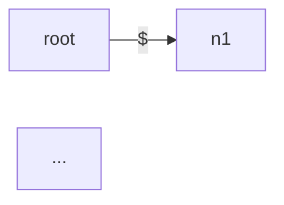

# suffix-tree-lab

## Overview
Build and query a compressed suffix tree for fast substring search, repeated-substring analysis, and interview-friendly structure visualization.

## Why it is portfolio-worthy
This project demonstrates string indexing, edge splitting, compact tree representations, query tracing, and testable CLI design. It is a strong discussion piece for algorithms, text search, and data-structure tradeoffs because the implementation is intentionally educational: construction is naive but the search surface behaves like a real suffix-tree interface.

## Features
- builds a compact edge-labeled suffix tree by inserting every suffix
- supports substring existence checks and occurrence lookup
- computes the longest repeated substring with configurable minimum occurrence count
- provides an `explain` mode that traces how a pattern is matched through compressed edges
- exports Graphviz DOT for quick rendering into SVG/PNG diagrams
- exports Mermaid flowcharts for README-friendly visualization without Graphviz
- optionally annotates exported nodes with suffix-start offsets for debugging and demos
- benchmarks suffix-tree lookup against a naive suffix-array baseline, Python `str.find`, and regex-lookahead baselines
- exports benchmark results as CSV so performance snapshots can be versioned in `artifacts/`
- includes a simple CLI for search, repetition analysis, structure export, and benchmark runs

## CLI usage
```bash
python3 suffix_tree_lab.py banana find ana
python3 suffix_tree_lab.py banana repeat
python3 suffix_tree_lab.py mississippi repeat --min-occurrences 3
python3 suffix_tree_lab.py banana explain band
python3 suffix_tree_lab.py banana export-dot > banana.dot
dot -Tsvg banana.dot -o banana.svg
python3 suffix_tree_lab.py banana export-dot --show-suffix-starts
python3 suffix_tree_lab.py banana export-mermaid > banana.mmd
python3 suffix_tree_lab.py banana export-mermaid --show-suffix-starts
python3 suffix_tree_lab.py "banana bandana banana" benchmark --patterns ana,ban,na
python3 suffix_tree_lab.py "banana bandana banana" benchmark --patterns ana,ban,na --csv --output ../../artifacts/suffix-tree-benchmark.csv
```

## Example output
```text
$ python3 suffix_tree_lab.py banana find ana
matches=[1, 3]

$ python3 suffix_tree_lab.py banana repeat
ana

$ python3 suffix_tree_lab.py "banana bandana banana" benchmark --patterns ana,ban --iterations 50
method           pattern  matches  total_seconds  avg_seconds
suffix_tree      ana      5             0.000069     0.000001
suffix_array     ana      5             0.000083     0.000002
suffix_tree      ban      3             0.000052     0.000001
python_find      ana      5             0.000022     0.000000
regex_lookahead  ban      3             0.000097     0.000002
# timings vary by machine; CSV export is the stable artifact format
```

```dot
$ python3 suffix_tree_lab.py banana export-dot
digraph suffix_tree {
  rankdir=LR;
  node [shape=circle, fontname="Helvetica"];
  edge [fontname="Helvetica"];
  n0 [label="root", shape=circle];
  n0 -> n1 [label="$"];
  ...
}
```



## Testing
```bash
pytest -q test_suffix_tree_lab.py
```

## Implementation notes
- appends a unique sentinel so every suffix ends at a leaf
- compresses shared prefixes into labeled edges instead of one-character trie edges
- stores suffix start offsets below each node to support occurrence reporting
- uses DOT as a zero-dependency interchange format so diagrams can be rendered externally with Graphviz
- adds Mermaid export so repository docs and GitHub previews can show the structure without a Graphviz install
- benchmark mode cross-checks suffix-tree match counts against suffix-array, Python, and regex baselines before recording timings
- the suffix-array baseline uses a deliberately naive sorted-suffix implementation so students can discuss binary-search lookup versus heavier suffix-tree structure
- exported CSV snapshots make it easy to discuss asymptotics versus real constant-factor tradeoffs in interviews
- favors readability and correctness over Ukkonen-level linear-time construction complexity

## Future improvements
- generalized suffix tree support for longest common substring across multiple texts
- rendered artifact generation during benchmarks so DOT and Mermaid exports stay in sync with timing snapshots
- add LCP-aware suffix-array searching to contrast the naive baseline with a more optimized indexed approach
- a streaming input mode that persists the index to disk for larger corpora
