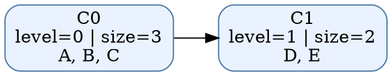
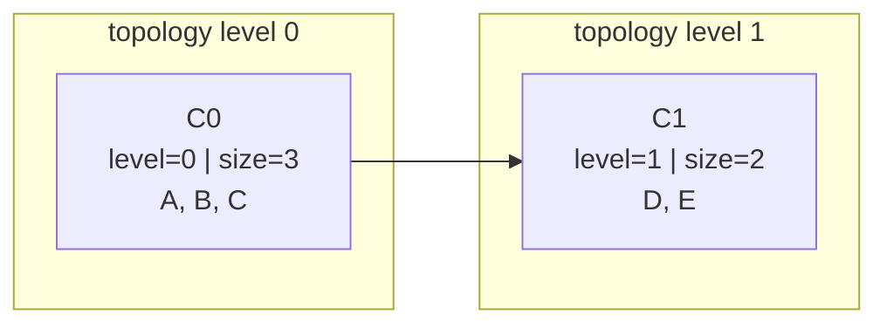

# Tarjan SCC Lab

A graph-algorithms portfolio project that finds strongly connected components in directed graphs, builds the condensation DAG, and compares Tarjan vs. Kosaraju on the same fixtures.

## What it demonstrates
- Tarjan's linear-time SCC algorithm with DFS discovery indexes and low-link values
- parsing directed graphs from either adjacency-list or edge-list JSON
- condensation DAG generation for reasoning about cycles at the component level
- deterministic JSON/text CLI output suitable for demos, scripting, and interviews
- side-by-side Tarjan vs. Kosaraju comparison with repeatable timing output
- CSV and Markdown benchmark-report exports for portfolio screenshots or static-site embeds
- focused automated tests for algorithm correctness, input validation, and CLI behavior

## Files
- `tarjan_scc_lab.py` — implementation and CLI
- `sample_graph.json` — demo graph with several SCCs
- `test_tarjan_scc_lab.py` — correctness and CLI tests

## Usage
```bash
cd projects/tarjan-scc-lab
python3 tarjan_scc_lab.py sample_graph.json scc
python3 tarjan_scc_lab.py sample_graph.json condensation
python3 tarjan_scc_lab.py sample_graph.json dot > condensation.dot
python3 tarjan_scc_lab.py sample_graph.json mermaid > condensation.mmd
python3 tarjan_scc_lab.py sample_graph.json compare --repeat 10
mkdir -p ../../docs/artifacts/tarjan-scc-lab
python3 tarjan_scc_lab.py sample_graph.json compare --repeat 10 \
  --csv-output ../../docs/artifacts/tarjan-scc-lab/sample-compare.csv \
  --markdown-output ../../docs/artifacts/tarjan-scc-lab/sample-compare.md \
  > ../../docs/artifacts/tarjan-scc-lab/sample-compare.json
python3 tarjan_scc_lab.py sample_graph.json explain --limit 4
../../.venv/bin/python -m pytest -q test_tarjan_scc_lab.py
```

## Input formats
Adjacency list:
```json
{
  "A": ["B"],
  "B": ["C"],
  "C": ["A", "D"],
  "D": []
}
```

Edge list:
```json
{
  "nodes": ["A", "B", "C", "D"],
  "edges": [
    {"from": "A", "to": "B"},
    {"from": "B", "to": "C"},
    {"from": "C", "to": "A"},
    {"from": "C", "to": "D"}
  ]
}
```

## Why this is portfolio-worthy
Strongly connected components come up in dependency analysis, compiler passes, graph databases, package management, and distributed-systems reasoning. This project shows algorithm knowledge, clean interfaces, and the ability to turn theory into a reusable tool.

## Output details
The SCC summary and condensation DAG now annotate each component with a `topology_level`, plus lightweight bottleneck metadata that highlights whether a component behaves like a source, sink, bridge, or isolated SCC. The lab can also export both Graphviz DOT and Mermaid views for portfolio screenshots or markdown-native demos:
- level `0` means a source SCC in the condensation DAG
- higher levels indicate longer downstream dependency distance from any source SCC
- `incoming_component_count` / `outgoing_component_count` summarize how many other SCCs feed into or depend on a component
- `bottleneck_role` classifies each SCC as `source`, `sink`, `bridge`, or `isolated`
- these annotations make it easier to explain build pipelines, dependency cycles, and chokepoints in interviews

Example condensation output excerpt:
```json
{
  "components": [
    {
      "id": "C0",
      "nodes": ["A", "B", "C"],
      "size": 3,
      "topology_level": 0,
      "incoming_component_count": 0,
      "outgoing_component_count": 1,
      "bottleneck_role": "source"
    },
    {
      "id": "C1",
      "nodes": ["D", "E"],
      "size": 2,
      "topology_level": 1,
      "incoming_component_count": 1,
      "outgoing_component_count": 1,
      "bottleneck_role": "bridge"
    }
  ],
  "edges": [{"from": "C0", "to": "C1"}],
  "edge_count": 1,
  "level_count": 2
}
```

Graphviz export example:



Mermaid export example:


This makes it easy to paste the condensation view directly into GitHub-flavored markdown that supports Mermaid.

The JSON `scc`, `condensation`, and text `explain` outputs also expose bottleneck summaries. That gives you quick interview talking points such as "this SCC is a bridge between two cycles" or "this singleton sink is where all paths converge" without manually inspecting the DAG.

The JSON outputs now also include `topology_groups`, which groups component payloads by topological level for downstream tooling, dashboards, or static-site portfolio embeds that want a layered SCC view without recomputing the grouping client-side.

Example `topology_groups` excerpt:
```json
[
  {
    "level": 0,
    "component_count": 1,
    "component_ids": ["C0"],
    "components": [
      {
        "id": "C0",
        "nodes": ["A", "B", "C"],
        "size": 3,
        "topology_level": 0,
        "incoming_component_count": 0,
        "outgoing_component_count": 1,
        "bottleneck_role": "source"
      }
    ]
  },
  {
    "level": 1,
    "component_count": 1,
    "component_ids": ["C1"],
    "components": [
      {
        "id": "C1",
        "nodes": ["D", "E"],
        "size": 2,
        "topology_level": 1,
        "incoming_component_count": 1,
        "outgoing_component_count": 1,
        "bottleneck_role": "bridge"
      }
    ]
  }
]
```

You can render the DOT file with Graphviz if installed:
```bash
dot -Tpng condensation.dot -o condensation.png
```

## Tarjan vs. Kosaraju comparison

The `compare` command runs both linear-time SCC algorithms against the same graph, checks whether they agree on the deterministic component ordering used by this project, and reports simple timing samples for interview talking points.

Example output excerpt:
```json
{
  "algorithms_match": true,
  "repeat": 10,
  "average_ms": {
    "tarjan": 0.031251,
    "kosaraju": 0.040812
  },
  "faster_algorithm": "tarjan | kosaraju | tie"
}
```

This gives the project a stronger "theory plus evaluation" story: one implementation is enough to solve the problem, but comparing both shows awareness of alternative SCC strategies and the trade-off of Kosaraju's transpose/pass structure.

The comparison flow can now also write portfolio-ready artifacts directly:
- `--csv-output` writes one row per timing run so you can chart variance in a spreadsheet or static site
- `--markdown-output` writes a report with graph metadata, average timings, per-run timing rows, a component roster, and ready-made interview talking points
- the repo includes a checked-in sample bundle under `docs/artifacts/tarjan-scc-lab/` for screenshot-friendly demos

Example Markdown report excerpt:
```md
# Tarjan vs Kosaraju benchmark report

## Graph summary
| metric | value |
| --- | --- |
| graph file | `sample_graph.json` |
| node count | 8 |
| edge count | 10 |
| strongly connected components | 4 |

## Per-run timings (ms)
| trial | tarjan_ms | kosaraju_ms | delta_ms | winner |
| --- | ---: | ---: | ---: | --- |
| 1 | 0.031251 | 0.040812 | 0.009561 | tarjan |
```

## Future improvements
- stream very large graphs from edge lists instead of loading everything into memory first
- add a small HTML report template that consumes the compare JSON/CSV bundle directly for layered SCC benchmark cards
- add a small HTML/markdown report template that consumes `topology_groups` directly for layered SCC portfolio cards
