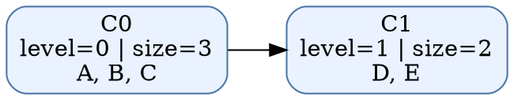
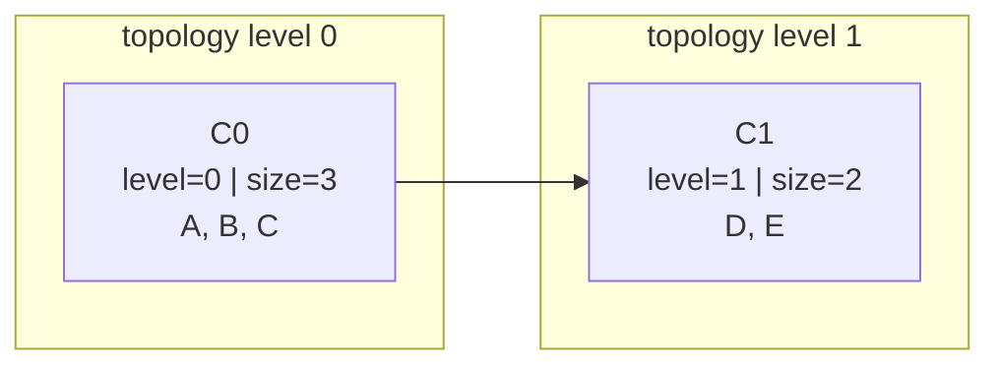

# Tarjan SCC Lab

A graph-algorithms portfolio project that finds strongly connected components in directed graphs and builds the condensation DAG.

## What it demonstrates
- Tarjan's linear-time SCC algorithm with DFS discovery indexes and low-link values
- parsing directed graphs from either adjacency-list or edge-list JSON
- condensation DAG generation for reasoning about cycles at the component level
- deterministic JSON/text CLI output suitable for demos, scripting, and interviews
- focused automated tests for algorithm correctness, input validation, and CLI behavior

## Files
- `tarjan_scc_lab.py` — implementation and CLI
- `sample_graph.json` — demo graph with several SCCs
- `test_tarjan_scc_lab.py` — correctness and CLI tests

## Usage
```bash
cd projects/tarjan-scc-lab
python3 tarjan_scc_lab.py sample_graph.json scc
python3 tarjan_scc_lab.py sample_graph.json condensation
python3 tarjan_scc_lab.py sample_graph.json dot > condensation.dot
python3 tarjan_scc_lab.py sample_graph.json mermaid > condensation.mmd
python3 tarjan_scc_lab.py sample_graph.json explain --limit 4
../../.venv/bin/python -m pytest -q test_tarjan_scc_lab.py
```

## Input formats
Adjacency list:
```json
{
  "A": ["B"],
  "B": ["C"],
  "C": ["A", "D"],
  "D": []
}
```

Edge list:
```json
{
  "nodes": ["A", "B", "C", "D"],
  "edges": [
    {"from": "A", "to": "B"},
    {"from": "B", "to": "C"},
    {"from": "C", "to": "A"},
    {"from": "C", "to": "D"}
  ]
}
```

## Why this is portfolio-worthy
Strongly connected components come up in dependency analysis, compiler passes, graph databases, package management, and distributed-systems reasoning. This project shows algorithm knowledge, clean interfaces, and the ability to turn theory into a reusable tool.

## Output details
The SCC summary and condensation DAG now annotate each component with a `topology_level`, and the lab can export both Graphviz DOT and Mermaid views for portfolio screenshots or markdown-native demos:
- level `0` means a source SCC in the condensation DAG
- higher levels indicate longer downstream dependency distance from any source SCC
- levels make it easier to explain build pipelines, dependency cycles, and call-graph collapse order in interviews

Example condensation output excerpt:
```json
{
  "components": [
    {"id": "C0", "nodes": ["A", "B", "C"], "size": 3, "topology_level": 0},
    {"id": "C1", "nodes": ["D", "E"], "size": 2, "topology_level": 1}
  ],
  "edges": [{"from": "C0", "to": "C1"}],
  "edge_count": 1,
  "level_count": 2
}
```

Graphviz export example:



Mermaid export example:


This makes it easy to paste the condensation view directly into GitHub-flavored markdown that supports Mermaid.

You can render the DOT file with Graphviz if installed:
```bash
dot -Tpng condensation.dot -o condensation.png
```

## Future improvements
- compare Tarjan and Kosaraju implementations with the same fixtures and benchmark output
- stream very large graphs from edge lists instead of loading everything into memory first
- annotate components with in-degree/out-degree summaries for easier bottleneck analysis
